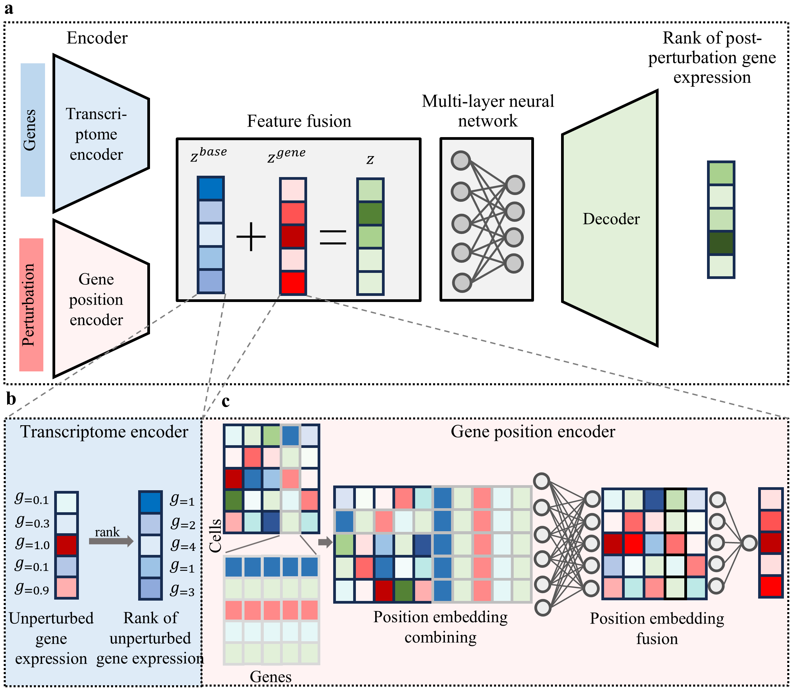

# scRGP: Prediction of Single-cell Genetic Perturbation Transcriptional Responses based on Rank in Multiple Scenarios

<H3>Overview</H3>
<p align="center">
  
</p>

scRGP provides a unified training framework for learning perturbation-response patterns from single-cell transcriptomic datasets. The implementation separates data processing and model training into independent modules, allowing different datasets and experimental settings to be used within the same pipeline.
The main workflow is:

Repository Structure
The main components of the repository are organized as follows:
```text
scRGP/
│
├── Training.py
│   └── scRGP model and training interface
│
├── PertDataProcess.py
│   └── Dataset loading, preprocessing, splitting and
│       DataLoader construction
│
├── main.py
│   └── Main training entry point
│
├── data/
│   └── Dataset files
```

---
Quick Start
The main training script accepts two command-line arguments:
```text
data_name
seed
```
Run the model with:
```bash
python main.py <data_name> <seed>
```
For example:
```bash
python main.py your_dataset 1
```
Here:
`your_dataset` is the name of the dataset.
`1` is the random seed.
The complete workflow is:
```text
1. Read dataset name and random seed
             ↓
2. Load perturbation dataset
             ↓
3. Prepare training split
             ↓
4. Build DataLoaders
             ↓
5. Initialize scRGP
             ↓
6. Initialize model architecture
             ↓
7. Train the model
```
---
